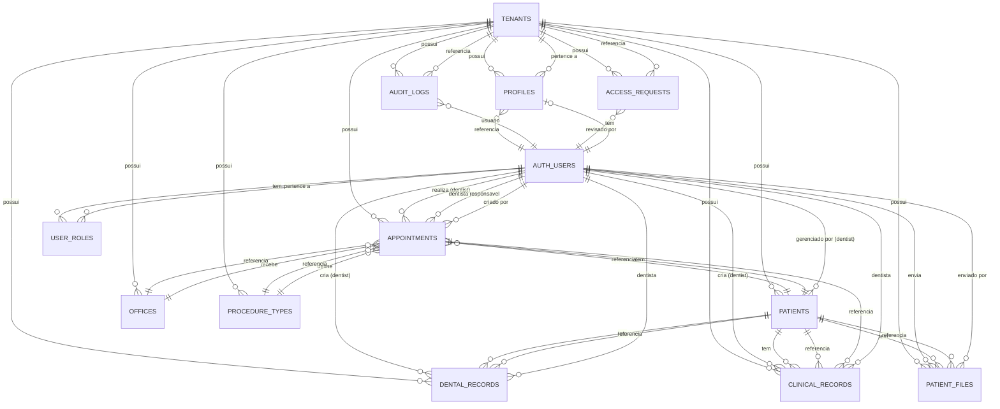
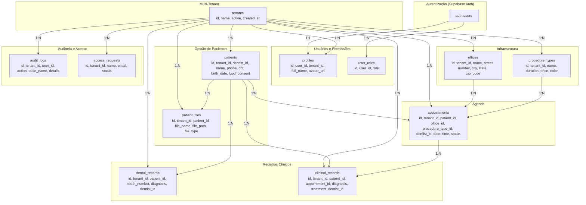

# SorrIA - Diagramas de Banco de Dados

## 1. Diagrama de Entidades de Relacionamento (DER)



---

## 2. Diagrama de Banco de Dados (Schema Detalhado)

### 2.1. Tabelas Principais

#### **tenants** (Clínicas/Empresas)
| Coluna | Tipo | Restrições | Descrição |
|--------|------|------------|-----------|
| id | UUID | PK, DEFAULT gen_random_uuid() | Identificador único |
| name | TEXT | NOT NULL | Nome da clínica |
| active | BOOLEAN | NOT NULL, DEFAULT true | Status ativo/inativo |
| created_at | TIMESTAMPTZ | NOT NULL, DEFAULT now() | Data de criação |

#### **profiles** (Perfis de Usuários)
| Coluna | Tipo | Restrições | Descrição |
|--------|------|------------|-----------|
| id | UUID | PK, DEFAULT gen_random_uuid() | Identificador único |
| user_id | UUID | FK → auth.users(id), UNIQUE, NOT NULL | Referência ao usuário |
| tenant_id | UUID | FK → tenants(id), NOT NULL | Clínica do usuário |
| full_name | TEXT | NOT NULL | Nome completo |
| avatar_url | TEXT | | URL do avatar |
| created_at | TIMESTAMPTZ | NOT NULL, DEFAULT now() | Data de criação |

#### **user_roles** (Papéis de Usuário)
| Coluna | Tipo | Restrições | Descrição |
|--------|------|------------|-----------|
| id | UUID | PK, DEFAULT gen_random_uuid() | Identificador único |
| user_id | UUID | FK → auth.users(id), NOT NULL | Referência ao usuário |
| role | app_role | NOT NULL | Papel: admin, dentist, super_admin |

> **Constraint UNIQUE:** (user_id, role) - um usuário não pode ter o mesmo papel duplicado

#### **patients** (Pacientes)
| Coluna | Tipo | Restrições | Descrição |
|--------|------|------------|-----------|
| id | UUID | PK, DEFAULT gen_random_uuid() | Identificador único |
| tenant_id | UUID | FK → tenants(id), NOT NULL | Clínica |
| dentist_id | UUID | FK → auth.users(id) | Dentista responsável |
| name | TEXT | NOT NULL | Nome do paciente |
| phone | TEXT | | Telefone |
| cpf | TEXT | | CPF |
| birth_date | DATE | | Data de nascimento |
| lgpd_consent | BOOLEAN | DEFAULT false | Consentimento LGPD |
| lgpd_consent_date | TIMESTAMPTZ | | Data do consentimento |
| lgpd_consent_ip | TEXT | | IP do consentimento |
| created_at | TIMESTAMPTZ | NOT NULL, DEFAULT now() | Data de criação |

#### **offices** (Consultórios)
| Coluna | Tipo | Restrições | Descrição |
|--------|------|------------|-----------|
| id | UUID | PK, DEFAULT gen_random_uuid() | Identificador único |
| tenant_id | UUID | FK → tenants(id), NOT NULL | Clínica |
| name | TEXT | NOT NULL | Nome do consultório |
| street | TEXT | | Rua |
| number | TEXT | | Número |
| neighborhood | TEXT | | Bairro |
| city | TEXT | | Cidade |
| state | TEXT | | Estado |
| zip_code | TEXT | | CEP |
| active | BOOLEAN | NOT NULL, DEFAULT true | Status ativo |

#### **procedure_types** (Tipos de Procedimento)
| Coluna | Tipo | Restrições | Descrição |
|--------|------|------------|-----------|
| id | UUID | PK, DEFAULT gen_random_uuid() | Identificador único |
| tenant_id | UUID | FK → tenants(id), NOT NULL | Clínica |
| name | TEXT | NOT NULL | Nome do procedimento |
| duration | INTEGER | NOT NULL, DEFAULT 30 | Duração em minutos |
| price | NUMERIC(10,2) | NOT NULL, DEFAULT 0 | Preço |
| color | TEXT | NOT NULL, DEFAULT '#3B82F6' | Cor para visualização |
| active | BOOLEAN | NOT NULL, DEFAULT true | Status ativo |

#### **appointments** (Consultas)
| Coluna | Tipo | Restrições | Descrição |
|--------|------|------------|-----------|
| id | UUID | PK, DEFAULT gen_random_uuid() | Identificador único |
| tenant_id | UUID | FK → tenants(id), NOT NULL | Clínica |
| patient_id | UUID | FK → patients(id), NOT NULL | Paciente |
| office_id | UUID | FK → offices(id), NOT NULL | Consultório |
| procedure_type_id | UUID | FK → procedure_types(id), NOT NULL | Procedimento |
| dentist_id | UUID | FK → auth.users(id) | Dentista responsável |
| created_by | UUID | FK → auth.users(id) | Criado por |
| appointment_date | DATE | NOT NULL | Data da consulta |
| appointment_time | TIME | NOT NULL | Horário da consulta |
| status | appointment_status | NOT NULL, DEFAULT 'scheduled' | Status |
| notes | TEXT | | Observações |
| google_calendar_event_id | TEXT | | ID do evento no Google Calendar |
| check_in_at | TIMESTAMPTZ | | Data/hora do check-in |
| check_out_at | TIMESTAMPTZ | | Data/hora do check-out |
| created_at | TIMESTAMPTZ | NOT NULL, DEFAULT now() | Data de criação |

---

### 2.2. Tabelas de Registros Clínicos

#### **dental_records** (Registros Dentais / Odontograma)
| Coluna | Tipo | Restrições | Descrição |
|--------|------|------------|-----------|
| id | UUID | PK, DEFAULT gen_random_uuid() | Identificador único |
| tenant_id | UUID | FK → tenants(id), NOT NULL | Clínica |
| patient_id | UUID | FK → patients(id), NOT NULL | Paciente |
| tooth_number | INTEGER | NOT NULL, CHECK 11-48 | Número do dente |
| diagnosis | TEXT | NOT NULL | Diagnóstico |
| notes | TEXT | | Observações |
| dentist_id | UUID | FK → auth.users(id) | Dentista |
| created_at | TIMESTAMPTZ | NOT NULL, DEFAULT now() | Data de criação |

#### **clinical_records** (Registros Clínicos)
| Coluna | Tipo | Restrições | Descrição |
|--------|------|------------|-----------|
| id | UUID | PK, DEFAULT gen_random_uuid() | Identificador único |
| tenant_id | UUID | FK → tenants(id), NOT NULL | Clínica |
| patient_id | UUID | FK → patients(id), NOT NULL | Paciente |
| appointment_id | UUID | FK → appointments(id) | Consulta associada |
| chief_complaint | TEXT | | Queixa principal |
| clinical_history | TEXT | | Histórico clínico |
| observations | TEXT | | Observações |
| diagnosis | TEXT | | Diagnóstico |
| treatment | TEXT | | Tratamento |
| dentist_id | UUID | FK → auth.users(id) | Dentista |
| created_at | TIMESTAMPTZ | NOT NULL, DEFAULT now() | Data de criação |

#### **patient_files** (Arquivos de Pacientes)
| Coluna | Tipo | Restrições | Descrição |
|--------|------|------------|-----------|
| id | UUID | PK, DEFAULT gen_random_uuid() | Identificador único |
| tenant_id | UUID | FK → tenants(id), NOT NULL | Clínica |
| patient_id | UUID | FK → patients(id), NOT NULL | Paciente |
| file_name | TEXT | NOT NULL | Nome do arquivo |
| file_path | TEXT | NOT NULL | Caminho do arquivo |
| file_type | TEXT | NOT NULL | Tipo do arquivo |
| uploaded_by | UUID | FK → auth.users(id) | Enviado por |
| created_at | TIMESTAMPTZ | NOT NULL, DEFAULT now() | Data de criação |

---

### 2.3. Tabelas de Auditoria e Acesso

#### **audit_logs** (Logs de Auditoria)
| Coluna | Tipo | Restrições | Descrição |
|--------|------|------------|-----------|
| id | UUID | PK, DEFAULT gen_random_uuid() | Identificador único |
| tenant_id | UUID | FK → tenants(id), NOT NULL | Clínica |
| user_id | UUID | NOT NULL | Usuário que realizou a ação |
| user_role | TEXT | | Papel do usuário |
| action | TEXT | NOT NULL | Ação realizada |
| table_name | TEXT | NOT NULL | Tabela afetada |
| record_id | TEXT | | ID do registro |
| entity | TEXT | | Entidade |
| entity_id | TEXT | | ID da entidade |
| description | TEXT | | Descrição |
| ip_address | TEXT | | Endereço IP |
| details | JSONB | | Detalhes adicionais |
| metadata | JSONB | | Metadados |
| created_at | TIMESTAMPTZ | NOT NULL, DEFAULT now() | Data de criação |

#### **access_requests** (Solicitações de Acesso)
| Coluna | Tipo | Restrições | Descrição |
|--------|------|------------|-----------|
| id | UUID | PK, DEFAULT gen_random_uuid() | Identificador único |
| tenant_id | UUID | FK → tenants(id) | Clínica associada |
| name | TEXT | NOT NULL | Nome do solicitante |
| email | TEXT | NOT NULL | Email |
| phone | TEXT | | Telefone |
| message | TEXT | | Mensagem |
| status | TEXT | NOT NULL, DEFAULT 'pending' | Status (pending, approved, rejected) |
| reviewed_by | UUID | FK → auth.users(id) | Revisado por |
| reviewed_at | TIMESTAMPTZ | | Data da revisão |
| created_at | TIMESTAMPTZ | NOT NULL, DEFAULT now() | Data de criação |

---

### 2.4. Enums

#### **appointment_status**
```
'scheduled' → 'checked_in' → 'waiting' → 'confirmed' → 'in_progress' → 'completed' → 'cancelled' → 'no_show'
```

#### **app_role**
```
'admin' | 'dentist' | 'super_admin'
```

---

## 3. Diagrama Visual do Schema



---

## 4. Funções e Triggers

### Funções

| Função | Retorno | Descrição |
|--------|---------|-----------|
| `has_role(_user_id, _role)` | BOOLEAN | Verifica se usuário tem um papel |
| `get_user_tenant_id(_user_id)` | UUID | Retorna o tenant do usuário |
| `handle_new_user()` | TRIGGER | Cria profile e role automaticamente |

### Triggers

| Trigger | Tabela | Função | Descrição |
|---------|--------|--------|-----------|
| `on_auth_user_created` | auth.users | handle_new_user() | Cria profile ao cadastrar usuário |

---

## 5. Storage Buckets

| Bucket | Público | Descrição |
|--------|---------|-----------|
| `patient-files` | Não | Arquivos de pacientes (raio-X, fotos, documentos) |
| `avatars` | Sim | Avatares de usuários |